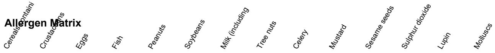

## PRODUCT SPECIFICATION SHEET

Product name: Custard Powder

Supplier: Ibérica Food Supply Co.

Product code: SKU-49546

Batch/Lot no.: L2026352-200 Country of origin: France

Storage conditions: Store at 0-4C, keep refrigerated

## Ingredients:

rosemary, coriander seed, thyme, olive oil, celeriac puree, rice flour, modified corn starch,

X = present T = may contain traces - = not present