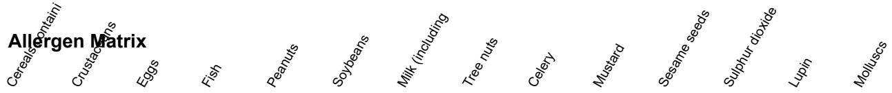

## PRODUCT SPECIFICATION SHEET

Product name: Romesco Sauce Base Supplier: Proveedora Catalana de Alimentacion Product code: SKU-86508 Batch/Lot no.: L2026322-572 Country of origin: Morocco Storage conditions: Store in a cool, dry place below 25C

## Ingredients:

egg lecithin, turmeric, oregano, rosemary, canola oil, lupin seeds, thyme, maltodextrin, leek.

X = present T = may contain traces - = not present