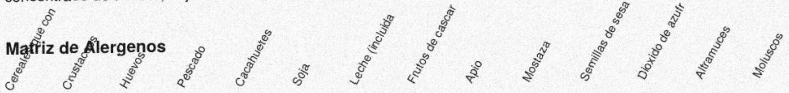
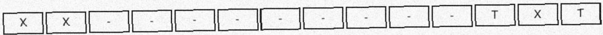

## FICHA TECNICA DE PRODUCTO

Nombre del producto: Mezcla de Croquetas Congeladas

Proveedor: Congelados del Ebro S.A.

Codigo de producto: SKU-96951

## Ingredientes:

aceite de oliva, extracto de cangrejo, almidon de trigo, harina de altramuz, pimienta negra,

concentrado de tomate, hoja de laurel, aceite de girasol, cebolla en polvo.

X = presente T = puede contener trazas - = no presente